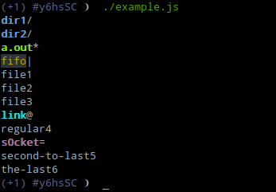

[](https://nodei.co/npm/ls-view/)

# ls-view

[![Dependency Status][david-badge]][david]

Turns type-annotated list of files into ls-styled output. Applies colors and appends type indicators.

[david]: https://david-dm.org/eush77/ls-view
[david-badge]: https://david-dm.org/eush77/ls-view.png

## Example

```js
var lsView = require('ls-view');

lsView([
  { name: 'file1' },
  { name: 'link', type: 'symlink' },
  { name: 'file2' },
  { name: 'dir2', type: 'directory' },
  { name: 'dir1', type: 'directory' },
  { name: 'file3' },
  { name: 'a.out', type: 'executable' },
  { name: 'regular4' },
  { name: 'second-to-last5' },
  { name: 'the-last6' },
  { name: 'fifo', type: 'fifo' },
  { name: 's0cket', type: 'socket' }
])
```



## Type indicators

`ls-view` appends type indicators based on the table below.

| Type       | Suffix              |
| :--------: | :-----------------: |
| directory  | `/`                 |
| symlink    | `@`                 |
| executable | `*`                 |
| fifo       | <code>&#x7c;</code> |
| socket     | `=`                 |

## API

### `lsView(files, [opt])`

Turns list of files into a string. Each file is an object with `name` and (optional) `type` keys.

#### `opt.color`

Type: `Boolean`<br>
Default: `true`

Enables colorful output.

#### `opt.suffixes`

Type: `Boolean`<br>
Default: `true`

Enables type suffixes.

#### `opt.groupDirectoriesFirst`

Type: `Boolean`<br>
Default: `true`

Groups directories before files.

#### `opt.sort`

Type: `Boolean`<br>
Default: `true`

Sorts files by name.

### `lsView.suffixes`

Mapping from types to suffixes.

### `lsView.colors`

Mapping from types to color functions.

## Install

```
npm install ls-view
```

## License

MIT
